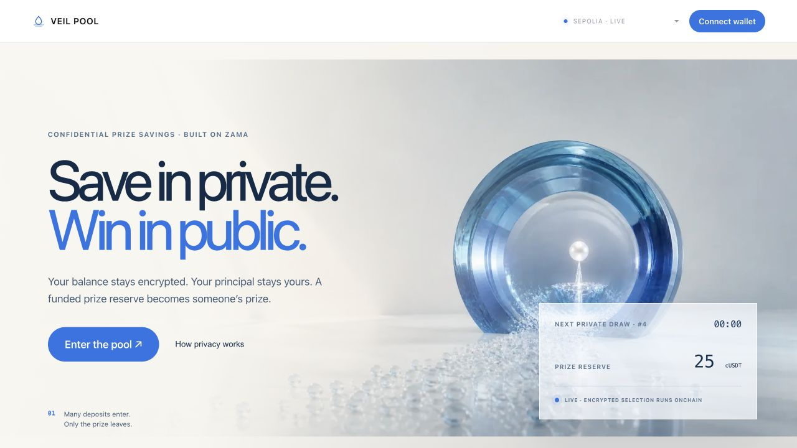
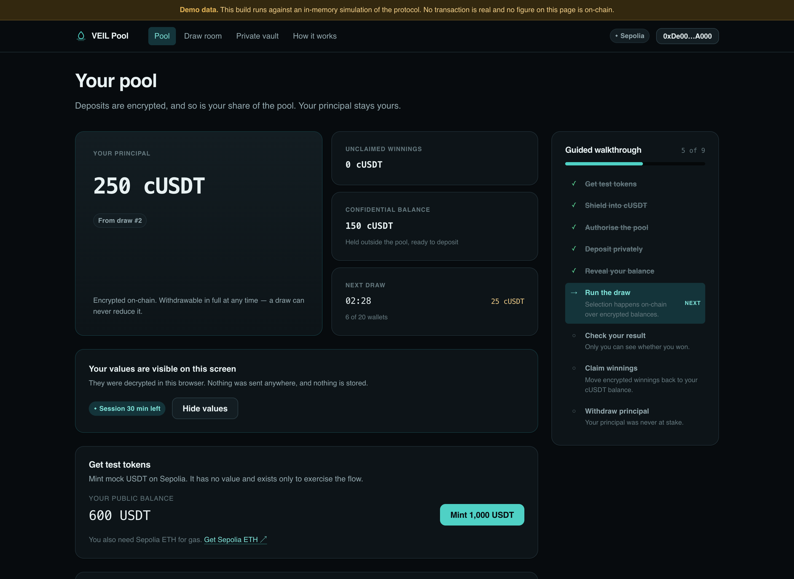
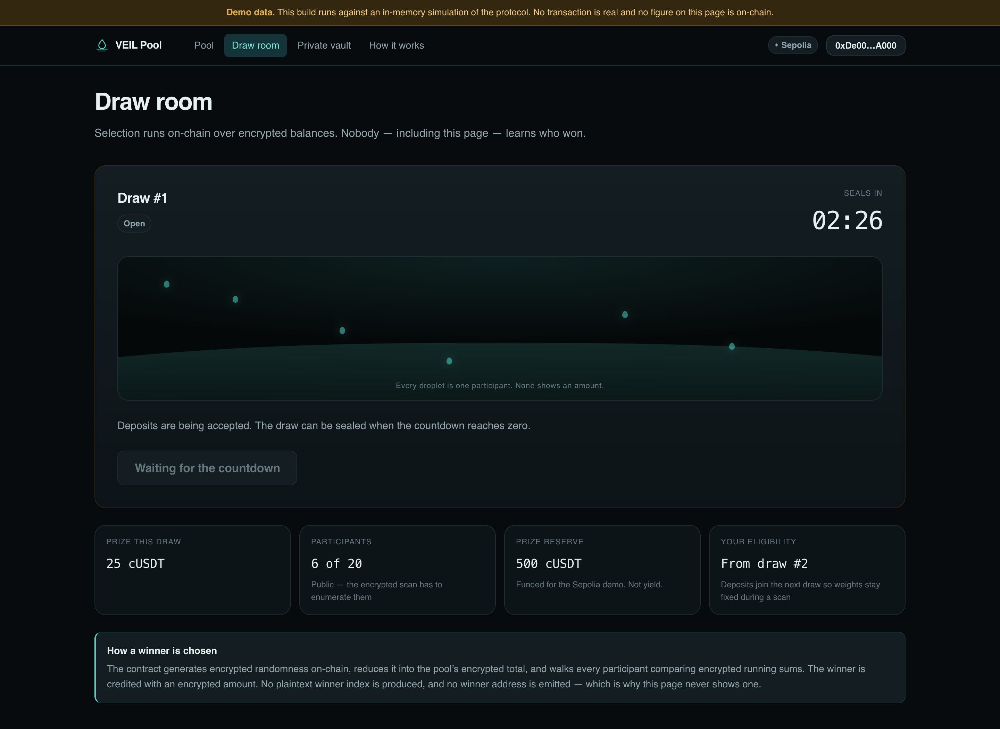
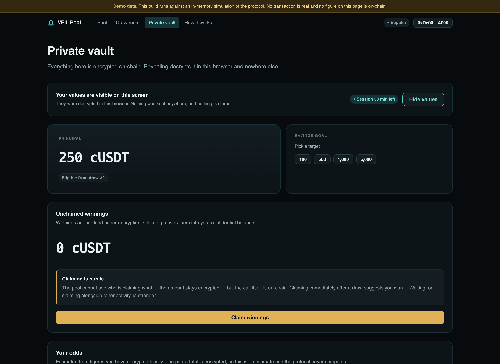
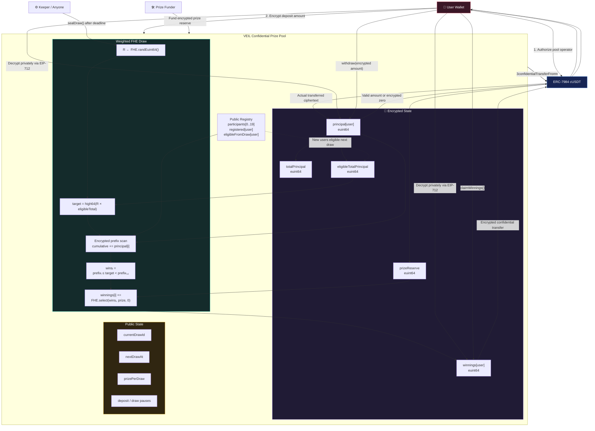

# VEIL Pool

VEIL Pool is a confidential prize-linked stablecoin savings protocol built on
Zama FHEVM. Users keep ownership of their principal while encrypted,
deposit-weighted draws allocate prizes without publishing balances, odds, or a
winner address.

The production contract is live on Sepolia. Ethereum support is readiness-gated
until a reviewed pool deployment is registered.

## Engineering workspaces

- `packages/reference-model`: executable mathematical model and property tests
- `packages/contracts`: FHEVM contracts and contract tests
- `packages/contract-abi`: generated frontend integration boundary
- `apps/web`: consumer application
- `docs/protocol`: protocol specification and algorithms
- `docs/security`: threat model and verification plan
- `docs/decisions`: architectural decision records

## Current gate

The weighted encrypted selection algorithm and its range-reduction bounds are
implemented and tested. The current gate is a complete two-wallet Sepolia
lifecycle, followed by Ethereum deployment simulation and multisig readiness.

---

## The product

*Product-workstream sections. The protocol sections above are authoritative for
anything the contracts do.*

### What a user does

Deposit stablecoins into a shared pool. Periodically a draw awards a prize funded
from a separate reserve, weighted by deposit size. Nobody loses principal, and
nobody — including the protocol — can see who saved how much, whose odds are
best, or who won.

The whole lifecycle runs in the browser with no CLI:

`faucet → shield → authorise → deposit → reveal → draw → check result → claim → withdraw`

A guided walkthrough panel tracks that sequence and always names the next action.
Its progress is reconciled against chain state, so reloading does not lose it.

### Screenshots

| | |
| --- | --- |
|  |  |
| The landing page leads with the problem, not the cryptography | Revealed values, decrypted locally, with the walkthrough alongside |
|  |  |
| The draw room — one droplet per participant, none showing an amount | The private vault, where the numbers are the only place they appear |

### Running it

The web app ships with an in-memory gateway, so every screen and every flow is
demonstrable without a deployment or a wallet:

```bash
pnpm install
pnpm dev            # http://localhost:3000, defaults to the live Sepolia deployment
```

Mock mode carries a standing, non-dismissible demo-data banner. It cannot be
mistaken for a live pool.

Sepolia is the default runtime. Set `NEXT_PUBLIC_SEPOLIA_RPC_URL` to use a
dedicated RPC; the public Sepolia transport remains available as a fallback.
`NEXT_PUBLIC_MAINNET_RPC_URL` configures the production transport. Ethereum is
shown in the network selector but remains unavailable until a real VEIL pool
deployment is registered; the UI never simulates mainnet readiness.
Set `NEXT_PUBLIC_VEIL_MODE=mock` only for the explicitly labelled local
simulation. The app reads addresses and ABIs only from
`packages/contract-abi` and fails loudly at boot if no deployment is present,
rather than rendering an empty pool.

```bash
pnpm --filter @veil/web typecheck
pnpm --filter @veil/web test
pnpm --filter @veil/web build
```

### Frontend architecture

Four layers, dependencies pointing inward only:

- **`domain/`** — pure TypeScript. Fixed-point money, the confidential-value
  model, the selection algorithm, flow state machines, the error taxonomy, and
  the privacy catalogue. No React, no wagmi, no viem client. Unit-tested
  directly.
- **`infrastructure/`** — adapters. Wallet connection, chain config, and the
  `PoolGateway` implementations. wagmi appears in exactly two files.
- **`features/`** — React modules, one per protocol action.
- **`app/`** — routes, thin.

`PoolGateway` is the seam. Screens are written against it and cannot tell a mock
from a deployment — which is why every flow was demonstrable before a contract
existed, and why the pool-full, reserve-empty and zero-weight states can be
exercised on demand rather than waited for.

The mock gateway runs the *same* weighted-selection algorithm the protocol runs,
in the clear, and reproduces the behaviours that bite: confidential transfers
clamp instead of reverting, deposits are not eligible for the draw they land in,
and the participant cap is enforced.

### Privacy claims

The interface states what leaks with the same prominence as what it protects.
`/how-it-works` carries the full boundary; each operation shows a privacy receipt
with a "visible on-chain" column; and inference risks are surfaced at the moment
the risk is taken — the claim card warns about claim timing *before* the claim
button.

Decrypted values, signatures and decryption keys live in memory only. They are
never written to storage, never placed in a URL, and are cleared on disconnect,
on account change, and on demand. Telemetry receives an error's classification
and nothing else.

### Product documentation

- `docs/product/PRODUCT-BRIEF.md` — thesis, personas, journey, IA, visual
  direction, architecture
- `docs/product/interface-requests/` — requests and research handed to the
  protocol workstream
- `docs/submission/` — demo video script and shot list, X thread draft


